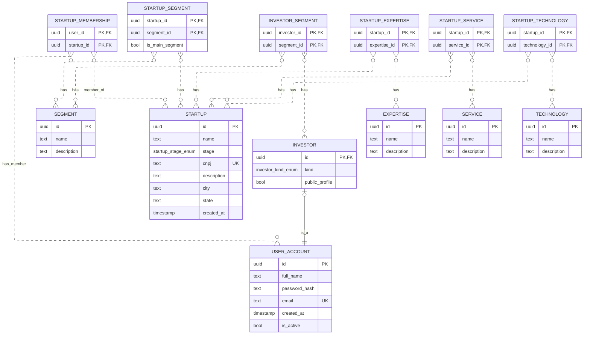

# REC IN TECH

```mermaid
---
config:
  layout: elk
---
erDiagram
  USER_ACCOUNT {
    uuid id PK
    text full_name
    text password_hash
    text email UK
    timestamp created_at
    bool is_active
  }

  SEGMENT {
    uuid id PK
    text name
    text description
  }

  STARTUP {
    uuid id PK
    text name
    startup_stage_enum stage
    text cnpj UK
    text description
    text city
    text state
    timestamp created_at
  }

  STARTUP_MEMBERSHIP }o..o{ USER_ACCOUNT : has_member
  STARTUP_MEMBERSHIP }o..o{ STARTUP : member_of
  STARTUP_MEMBERSHIP {
    uuid user_id PK, FK
    uuid startup_id PK, FK
  }

  INVESTOR |o--|| USER_ACCOUNT : is_a
  INVESTOR {
    uuid id PK, FK
    investor_kind_enum kind
    bool public_profile
  }

  STARTUP_SEGMENT }o..o{ STARTUP : has
  STARTUP_SEGMENT }o..o{ SEGMENT : has
  STARTUP_SEGMENT {
    uuid startup_id PK, FK
    uuid segment_id PK, FK
    bool is_main_segment
  }

  INVESTOR_SEGMENT }o..o{ INVESTOR : has
  INVESTOR_SEGMENT }o..o{ SEGMENT : has
  INVESTOR_SEGMENT {
    uuid investor_id PK, FK
    uuid segment_id PK, FK
  }

  EXPERTISE {
    uuid id PK
    text name
    text description
  }

  STARTUP_EXPERTISE }o..o{ STARTUP : has
  STARTUP_EXPERTISE }o..o{ EXPERTISE : has
  STARTUP_EXPERTISE {
    uuid startup_id PK, FK
    uuid expertise_id PK, FK
  }

  SERVICE {
    uuid id PK
    text name
    text description
  }

  STARTUP_SERVICE }o..o{ STARTUP : has
  STARTUP_SERVICE }o..o{ SERVICE : has
  STARTUP_SERVICE {
    uuid startup_id PK, FK
    uuid service_id PK, FK
  }

  TECHNOLOGY {
    uuid id PK
    text name
    text description
  }

  STARTUP_TECHNOLOGY }o..o{ STARTUP : has
  STARTUP_TECHNOLOGY }o..o{ TECHNOLOGY : has
  STARTUP_TECHNOLOGY {
    uuid startup_id PK, FK
    uuid technology_id PK, FK
  }
```
