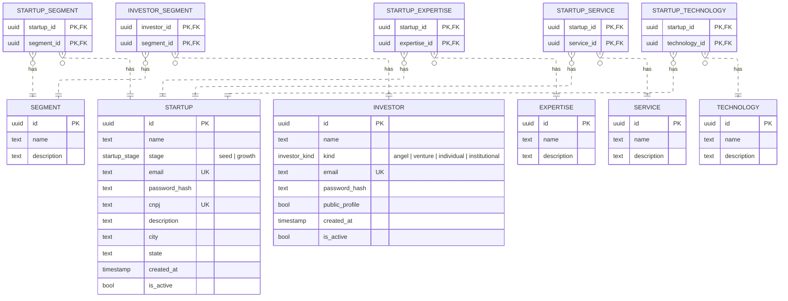

# REC IN TECH

```mermaid
---
config:
  layout: elk
---
erDiagram
  SEGMENT {
    uuid id PK
    text name
    text description
  }

  STARTUP {
    uuid id PK
    text name
    startup_stage stage "seed | growth"
    text email UK
    text password_hash
    text cnpj UK
    text description
    text city
    text state
    timestamp created_at
    bool is_active
  }

  INVESTOR {
    uuid id PK
    text name
    investor_kind kind "angel | venture | individual | institutional"
    text email UK
    text password_hash
    bool public_profile
    timestamp created_at
    bool is_active
  }

  STARTUP_SEGMENT }o..|| STARTUP : has
  STARTUP_SEGMENT }o..|| SEGMENT : has
  STARTUP_SEGMENT {
    uuid startup_id PK, FK
    uuid segment_id PK, FK
  }

  INVESTOR_SEGMENT }o..|| INVESTOR : has
  INVESTOR_SEGMENT }o..|| SEGMENT : has
  INVESTOR_SEGMENT {
    uuid investor_id PK, FK
    uuid segment_id PK, FK
  }

  EXPERTISE {
    uuid id PK
    text name
    text description
  }

  STARTUP_EXPERTISE }o..|| STARTUP : has
  STARTUP_EXPERTISE }o..|| EXPERTISE : has
  STARTUP_EXPERTISE {
    uuid startup_id PK, FK
    uuid expertise_id PK, FK
  }

  SERVICE {
    uuid id PK
    text name
    text description
  }

  STARTUP_SERVICE }o..|| STARTUP : has
  STARTUP_SERVICE }o..|| SERVICE : has
  STARTUP_SERVICE {
    uuid startup_id PK, FK
    uuid service_id PK, FK
  }

  TECHNOLOGY {
    uuid id PK
    text name
    text description
  }

  STARTUP_TECHNOLOGY }o..|| STARTUP : has
  STARTUP_TECHNOLOGY }o..|| TECHNOLOGY : has
  STARTUP_TECHNOLOGY {
    uuid startup_id PK, FK
    uuid technology_id PK, FK
  }
```
